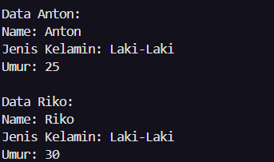

# Praktikum2

| Keterangan  | Data |
| --- |  --- |
| **Nama** | Eky Fikri Yamansyah |
| **NIM** | 312310572 |
| **Kelas** | TI.23.A6 |

## Latihan 2
Buatlah kode program java untuk:
* Mendeklarasikan class Person, dengan
atribut Nama, JenisKelamin, Umur dan
lengkapi dengan access modifier.
* Buatlah dua buah objek dari class Person
bernama Anton dan Riko dan panggil
method setter dan getter.


## Code :
```java
public class person {

    // Atribut person degan acces modifier private
    private String nama;
    private String jenisKelamin;
    private int umur;

    // Kostruktor
    public person(String nama, String jenisKelamin, int umur) {
        this.nama = nama;
        this.jenisKelamin = jenisKelamin;
        this.umur = umur;
    }

    // method setter dan getter
    public String getNama() {
        return nama;
    }

    public void setNama(String nama) {
        this.nama = nama;
    }

    public String getJenisKelamin() {
        return jenisKelamin;
    }

    public void setJenisKelamin(String jenisKelamin) {
        this.jenisKelamin = jenisKelamin;
    }

    public int getUmur() {
        return umur;
    }

    public void setUmur(int umur) {
        this.umur = umur;
    }

    public static void main(String[] args) {

        // Objek Anton
        person anton = new person("anton", "Laki-Laki", 25);
        // Objek Riko
        person riko = new person("Riko", "Laki-Laki", 35);

        anton.setNama("Anton");
        anton.setJenisKelamin("Laki-Laki");
        anton.setUmur(25);

        System.out.println("Data Anton: ");
        System.out.println("Name: " + anton.getNama());
        System.out.println("Jenis Kelamin: " + anton.getJenisKelamin());
        System.out.println("Umur: " + anton.getUmur() + "\n");

        riko.setNama("Riko");
        riko.setJenisKelamin("Laki-Laki");
        riko.setUmur(30);

        System.out.println("Data Riko: ");
        System.out.println("Name: " + riko.getNama());
        System.out.println("Jenis Kelamin: " + riko.getJenisKelamin());
        System.out.println("Umur: " + riko.getUmur());

    }

}

```

## Output:


